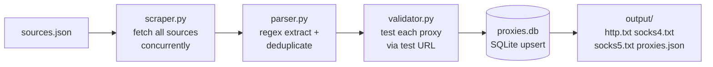

# Proxy Scraper & Validator

A menu-driven terminal app that scrapes public proxy lists, checks which
ones actually work, and exports clean `ip:port` files sorted by speed.

Built with `aiohttp` + `asyncio` (concurrent networking) and `rich`
(panels, tables, progress bars, prompts). No web UI, no CLI flags to
memorize — just run it and pick a number.

> ⚠️ **WARNING: free proxies are untrusted.** Anyone running a free proxy
> can read unencrypted traffic. Never log in, never enter passwords or
> payment details, and never send sensitive data through these proxies.
> Use them for learning, testing, and low-stakes scraping only.

## Pipeline



Or as ASCII, for terminals that can't render Mermaid:

```
sources.json ──► scrape (async) ──► parse + dedupe ──► validate (async)
                                                        │
                                              SQLite upsert (proxies.db)
                                                        │
                                              export ──► output/*.txt + proxies.json
```

## Screenshots

> Placeholders — replace with your own captures.

| Main menu | Live progress | Results |
|---|---|---|
| `docs/screenshots/menu.png` | `docs/screenshots/live.png` | `docs/screenshots/results.png` |


GIF demo: `docs/demo.gif`

## Install

Requires Python 3.10+.

```bash
git clone <your-repo-url>
cd proxy-scraper
python -m venv .venv
# Windows:
.venv\Scripts\activate
# macOS/Linux:
source .venv/bin/activate
pip install -r requirements.txt
```

## Usage

```bash
python main.py
```

Two-step flow: scrape first, then validate. Validating automatically
saves everything to the `output/` folder as plain text, including a
full dump of the database (`all_proxies.txt`).

You will see a banner and a numbered menu:

```
[1] Scrape proxies (step 1)
[2] Validate proxies (step 2, saves text files)
[3] View stats
[4] Settings
[5] Exit
```

- **Settings** edits `config.json` interactively (sources path, concurrency,
  timeout, test URL, output dir) and persists across restarts.
- **Ctrl+C** at any time cancels the current job and returns to the menu —
  it never kills the app.
- A failing source shows a red `⚠` warning line in the live view and is
  skipped; one bad site never crashes the run.

## Example output

`output/http.txt` (fastest first):

```text
45.12.34.56:8080
103.45.67.89:3128
```

`output/proxies.json`:

```json
[
  {
    "ip": "45.12.34.56",
    "port": 8080,
    "protocol": "http",
    "alive": 1,
    "latency_ms": 612,
    "anonymity": "anonymous",
    "last_checked": "2026-10-08T12:00:00+00:00",
    "source": "TheSpeedX HTTP"
  }
]
```

## Project structure

```
proxy-scraper/
├── main.py           # the whole app (config, scraping, validation, UI)
├── sources.json      # auto-created with defaults if missing
├── config.json       # auto-created with defaults
├── proxies.db        # SQLite storage (auto-created)
├── output/           # http.txt, socks4.txt, socks5.txt, proxies.json, all_proxies.txt
├── requirements.txt
├── README.md
├── .gitignore
└── LICENSE (MIT)
```

## Adding a new source

Append one object to `sources.json`:

```json
{"name": "My list", "url": "https://example.com/proxies.txt",
 "format": "text", "protocol": "http"}
```

- `format`: `text`, `html`, or `json`.
- `protocol`: `http`, `socks4`, or `socks5` (assumed when a line has no prefix).
- optional `regex`: custom pattern with named groups `ip`, `port`, `scheme`.

## Adding a new menu option

1. Write an `async def my_screen(console, cfg)` function in `main.py`.
2. Add one row to `show_menu()` and one `elif` branch in `run_menu()`.

## Config

`config.json` (created automatically on first run):

```json
{
  "sources_path": "sources.json",
  "concurrency": 500,
  "timeout": 10,
  "site": "https://api.ipify.org?format=json",
  "output_dir": "output"
}
```

## License

MIT — see [LICENSE](LICENSE).
